# Stock Portfolio

## Background

Stock Portfolio application is a simple web app that allows you to manage and track your stock portfolio. You can add stocks, update their details and see the market value and gain/loss of your portfolio

    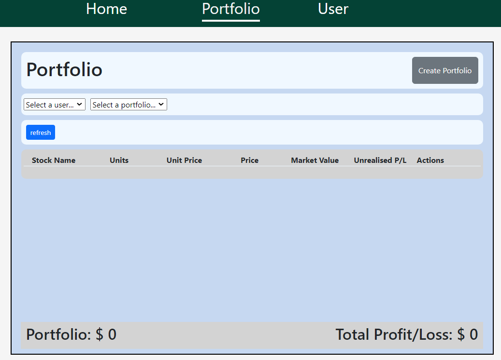 
    
portfolio page

    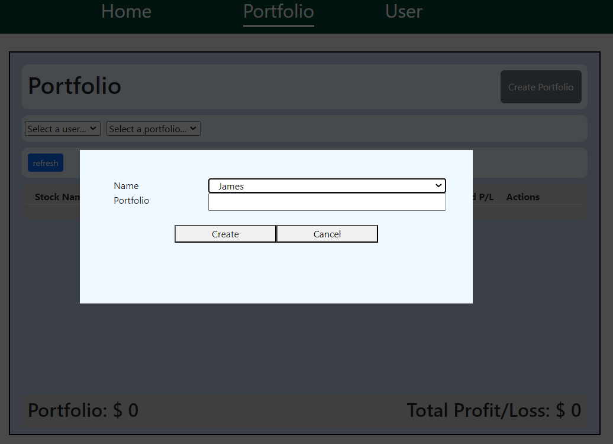
    
create portfolio modal

    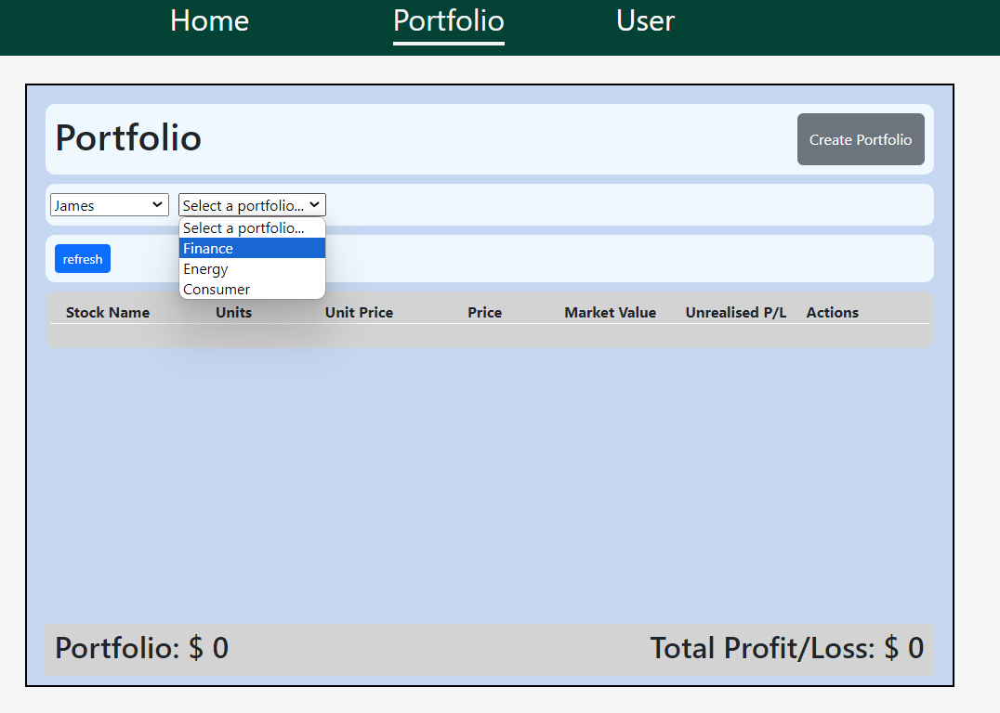
    
select user's portfolio

    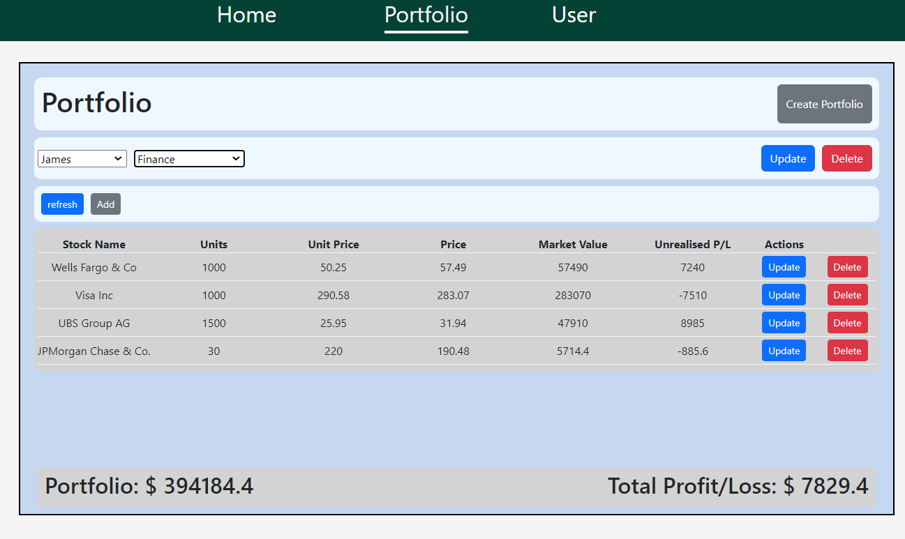
    
full display of portfolio

    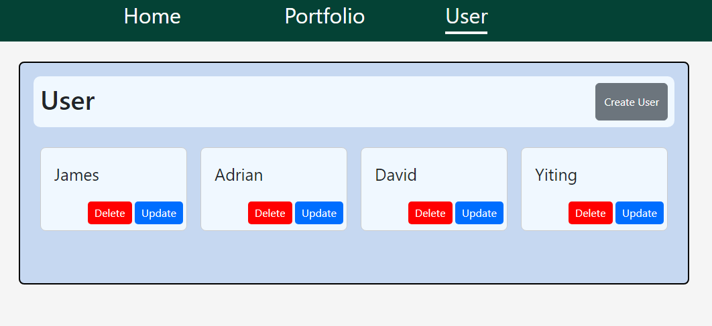
    
user page

    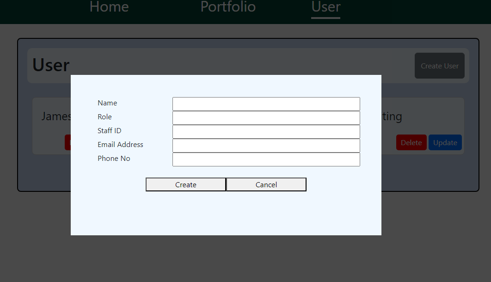
    
create user modal

    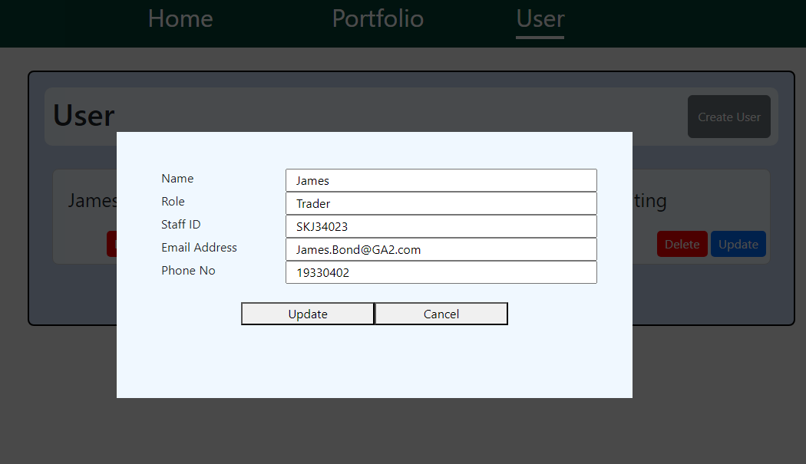
    
update user modal

## Technologies Used

    
    
    
    

## Getting Started

The public board can be accessed [_here_](https://junxiulow.atlassian.net/jira/software/projects/KAN/boards/1)

Below is the screenshots of the public board.

    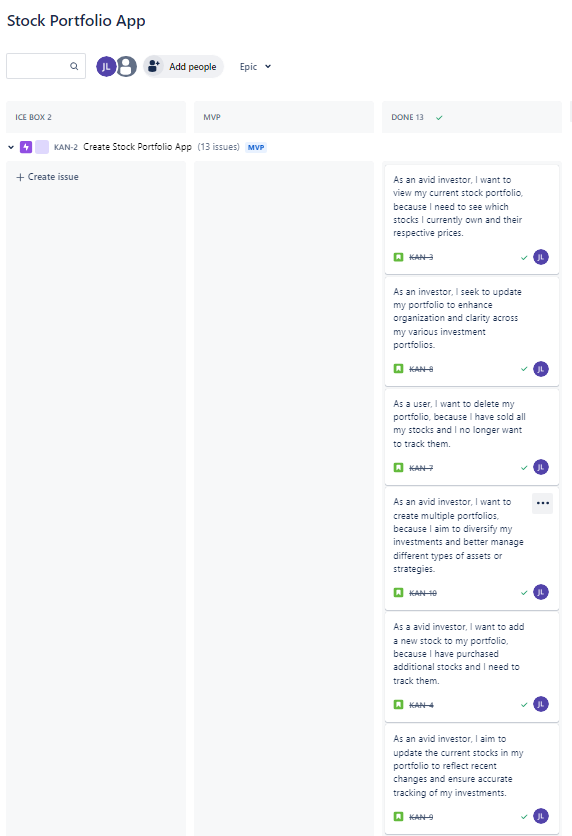
    
page 1

    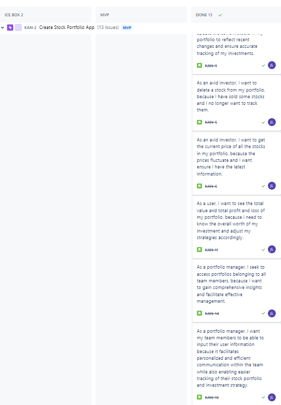
    
page 2

    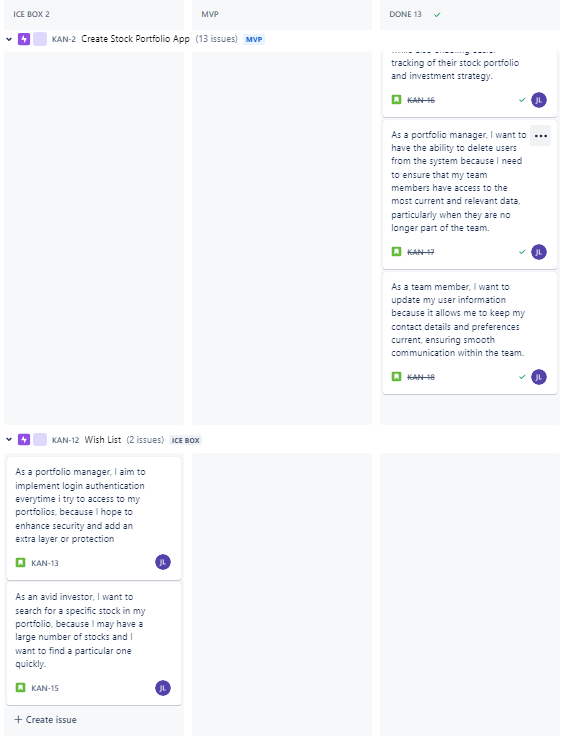
    
page 3

Wireframe design & REACT Component (HIERARCHY) can be accessed [_here_](https://drive.google.com/file/d/1zOeRTyNYFRNQ0TmTDcYhmpdcUv8kITRX/view?usp=sharing)

    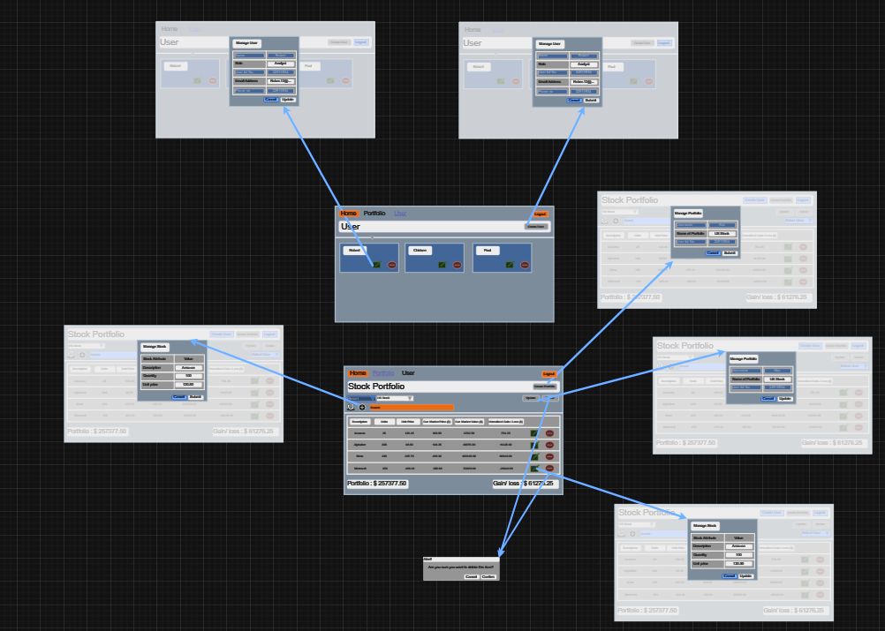
    
wireframe

    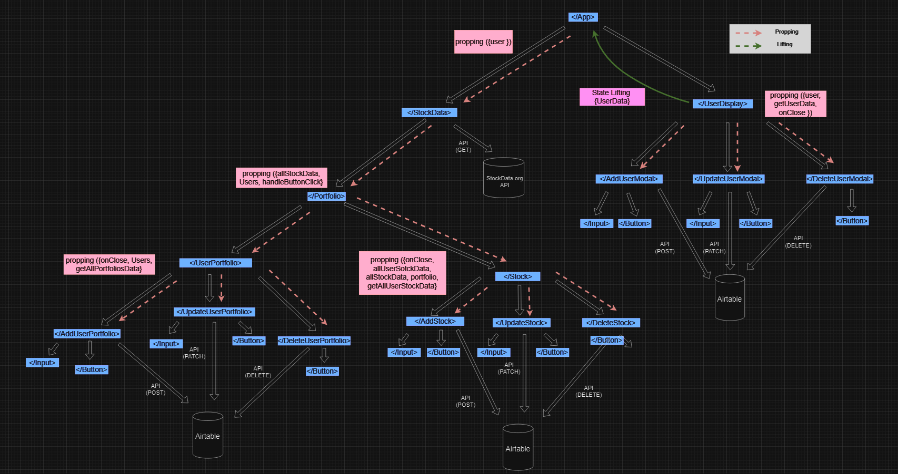
    
react component hierarchy

## Application Design

The portfolio app is divided into 3 main components and a root component written in JavaScript using React framework:

### 1. Root component of the application `App()`

`handleUsersData` - this callback function is defined to lift the 'users' state with the provided 'userData' from `userDisplay` component.

`<Route>` - helps to define routes and render different components `</UserDisplay>`, `</HomePage>`, and `</StockData>`

`StockData` - the 'users' state is passed from APP component to stockData.

### 2. `StockData`

`getAllStockData()` - This function fetches stock data from an Airtable database by sending a GET request to the specified API endpoint (airtableUrl), including the required Authorization header. Upon successful response, it updates the allStockData state with the fetched data, while logging any errors encountered during the process.

`createStockData()` - This function is responsible for adding new stock data to the Airtable database. It sends a POST request to the Airtable API endpoint designated for adding records, containing the provided stock data. Upon successful creation, it logs a confirmation message, and in case of failure, it throws an error.

`updateStockData()` - This function updates existing stock data in the Airtable database. It sends a PATCH request to the API endpoint for updating records, including the updated fields and the ID of the record to be modified. Before sending the request, it verifies if the data in Airtable is already up-to-date based on a comparison of timestamps. Upon successful update, it logs a confirmation message; otherwise, it throws an error.

`processStockDataButton()` - This function automates the process of retrieving, processing, and synchronizing stock data between an external API and the Airtable database. It iterates over a list of stock tickers, fetching raw data from the external API and then checking and updating records in Airtable. After processing all data, it refreshes the local state with the updated information. Any errors encountered during the process are logged for debugging purposes. This function is passed down as a prop to `</portfolioDisplay>` component through `handleButtonclick()` function

### 3. `PortfolioDisplay`

`getAllPortfoliosData()` - This function retrieves all portfolio data from the Airtable database by sending a GET request to the corresponding API endpoint. Upon successful retrieval, it updates the state variable allPortfolios with the fetched data, facilitating access to portfolio information throughout the component.

`getSelectedUserPortfolios(selectedUser)` - This function retrieves the portfolios associated with a selected user from the Airtable database. It filters the allPortfolios data based on the provided selectedUser ID and updates the state variable selectedUserPortfolios with the relevant portfolio information.

`getAllUserStockData()` - This function retrieves all user stock data from the Airtable database by sending a GET request to the corresponding API endpoint. Upon successful retrieval, it updates the state variable allUserStockData with the fetched data, allowing access to user stock information throughout the component.

In addition, several child components are imported and conditionally rendered based on the state of boolean flags. These flags control whether certain modals should be displayed or not. Here's a breakdown:

-   `AddUserPortfolioModal` - This modal allows users to add a new portfolio. 

-   `DeleteUserPortfolioModal` - This modal enables users to delete a portfolio. 
-   `UpdateUserPortfolioModal` - This modal lets users update an existing portfolio. 

-   `AddStockModal` - This modal allows users to add a new stock to a portfolio. 

-   `UpdateStockModal` - This modal enables users to update details of a stock.

-   `DeleteStockModal` - This modal allows users to delete a stock from a portfolio.

### 4. `UserDisplay`

`getUserData()` - is an asynchronous function designed to retrieve user data from an Airtable database by making a request using the provided API token and URL. Once the data is successfully fetched, it updates the local state Users with the received data using the `setUsers(userData)` function. Additionally, it invokes the `handleUsersData` function, passed down as a prop, to provide the fetched user data for further processing or display within the application. In case of an error during the fetching process, it logs the error message to the console for debugging purposes.

3 child components are being rendered:

-   `AddUserModal` - handles the addition of new users, displaying a modal interface for user input.

-   `DeleteUserModal` - allows users to delete existing users, presenting a modal interface for user confirmation.

-   `UpdateUserModal` -  enables users to modify existing user details, displaying a modal interface with pre-filled user information. 

## Takeaways

### 1. Usage of Axios and Fetch (from classmates):

-   Axios and Fetch are both JavaScript libraries used for making HTTP requests in web applications. While Fetch is a built-in browser API, Axios is a standalone library that offers several advantages over Fetch. 

- Axios provides a simpler and more intuitive API, consistent behavior across different browsers, and features like interceptors for modifying requests and responses globally, request cancellation, and convenience methods for handling data. These features make Axios a popular choice for developers when working with APIs and managing network requests in web applications, offering a more comprehensive and user-friendly solution compared to Fetch.

### 2. Using `useContext` over prop drilling and lifting state

-   Using useContext in React offers a more elegant solution for managing shared state and values compared to prop drilling and lifting state (especially there are multiple levels of components). By encapsulating shared data within a context provider, useContext enables components to consume this data without the need for passing props through intermediary components.

-   This approach enhances code maintainability and readability by eliminating the clutter caused by prop drilling. Additionally, useContext promotes better component reusability by allowing components to access context values wherever they are in the component tree, fostering a more modular and scalable architecture

### 3. `useNavigation` and `useLocation` (from Marcos)

-   In React, utilizing hooks like useNavigation and useLocation from navigation libraries such as React Router offers clear advantages over prop drilling and lifting state. 

-   These hooks enable components to directly access navigation functionality and location data, eliminating the need for passing props through multiple levels of the component hierarchy. This results in more encapsulated and reusable components, cleaner code, improved maintainability, and reduced risk of bugs. 

-   Additionally, using these hooks provides a more intuitive and consistent approach to handling navigation and location-related logic throughout the application, ultimately enhancing developer productivity and promoting better application design.

## Next Steps

### Icebox items:
-   `login()` - to implement login authentication for portfolio access, aiming to bolster security and safeguard sensitive financial data. This will require users, including portfolio managers, to authenticate themselves before accessing portfolios, thus preventing unauthorized access and enhancing overall system security.

-   `search()` - a feature that enables/allows users to quickly locate and assess particular investments, saving time and enabling more informed decision-making.

